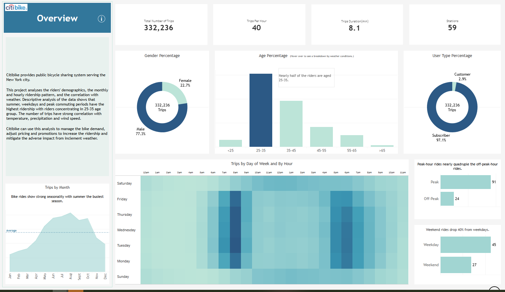

# Rider Demand & Weather Impact Analysis


## Project Overview
Citi Bike is New York City’s official bike‑share program, offering residents and visitors a convenient, affordable, and sustainable alternative to walking, taxis, buses, and subways. With over 1.6 million active riders, Citi Bike generates a rich volume of trip and rider data every day.

This project uses Citi Bike data, combined with weather data, to generate actionable insights that support product design, pricing strategy, and operational planning.

## Business Problem
The Citi Bike management team wants deeper visibility into rider behavior and rider profiles in order to:

* Better understand who their riders are
* Identify usage patterns and demand drivers
* Design more targeted products and pricing strategies that align with customer needs

At the same time, the operations team has observed that weather conditions significantly impact bike ridership. Large swings in demand caused by weather create challenges for bike availability, rebalancing, and overall service quality.

The business would like to answer the following key questions:

* What are the key rider segments and usage patterns?
* How does ridership vary by season, date and time?
* Which weather conditions (e.g. temperature, rain, wind) have the greatest impact on ridership?
* How can Citi Bike anticipate and mitigate demand fluctuations driven by weather?

## Project Objectives

* Build a data analytics pipeline to ingest, transform, and analyze Citi Bike trip data
* Enrich trip data with external weather data
* Perform exploratory and analytical analysis to uncover rider behavior patterns
* Quantify the impact of weather on ridership
* Deliver business‑ready insights that can support decision‑making
  
## Data
The project uses Citi Bike’s publicly available historical trip data, which includes start and end times, station IDs, geographic coordinates, user type, birth year, and gender for each individual ride. I extracted a full year of data from January to December 2018, totaling more than 380,000 records, to analyse trends, patterns, and seasonality in ridership. To enrich the analysis, I incorporated hourly New York City weather data—covering temperature, humidity, wind speed, and weather conditions. Combining these datasets enables a deeper understanding of rider demographics and the relationship between ridership and weather.

## Key Analysis
* Rider profile analysis (member vs casual, usage frequency, trip duration)
* Temporal analysis (hourly, daily, weekly, seasonal trends)
* Weather impact analysis (temperature, precipitation, extreme conditions)

## Data Engineering & Analytics Architecture

This project follows an end-to-end data engineering and analytics workflow, simulating a production-style pipeline from raw data ingestion to business-facing dashboards.

1. Data Ingestion

* Monthly Citi Bike trip data is downloaded to a local environment
* Raw files are unzipped and validated for schema consistency
* Monthly datasets are uploaded to AWS S3 as the raw data layer
* Historical weather data is also uploaded to S3 as a separate source

2. Data Consolidation (AWS Lambda)

Created an AWS Lambda function and is triggered after data upload

The function:

* Reads monthly trip files from S3
* Consolidates them into a single, unified trip dataset
* Writes the consolidated dataset back to S3

This step mimics an automated ingestion process commonly used in cloud-based data platforms.

3. Data Warehouse & Transformation (Amazon Redshift)

* Amazon Redshift is used as the analytical data warehouse
* Redshift reads data directly from S3
* Data cleaning, joins, and transformations are performed in Redshift using SQL, including:
  * Trip-level normalization
  * Rider-type enrichment
  * Time-based feature engineering
  * Joining trip data with weather data

4. Analytics & Visualization

* Tableau connects directly to Redshift
* Curated analytical tables are used to build dashboards for:
  * Rider behavior and segmentation
  * Temporal ridership trends
  * Weather impact on demand

## Tech Stack

* AWS S3 (data lake / raw storage)
* AWS Lambda (serverless data consolidation)
* Amazon Redshift (cloud data warehouse)
* SQL (data transformation and analytics)
* Tableau (data visualization)

## Dashboard 

Click the preview image below will link to the full dashboard.

[](https://github.com/RuthyYao/Weather-Impact-on-bike-ridership/blob/main/Dashboard.pdf)


## Key Insights

* **Commuting-driven usage**: Daily commuting is the primary use case, with the highest engagement from riders aged 25–35, and male riders outnumbering female riders by approximately 3.5×.

* **Strong temporal patterns**:

  * Weekday ridership is significantly higher than weekends (≈ **40% drop** on weekends).
  * Peak-hour rides are nearly **4× higher** than off-peak periods, reinforcing the commuter-driven nature of demand.

* **Pronounced seasonality**: Ridership peaks between **April and October**, with summer as the busiest season.

* **Weather sensitivity**: Trip volume is strongly correlated with **temperature, precipitation, and wind speed**, while humidity and cloud cover have minimal impact.

## Recommendations

* **Double down on the core commuter segment**:
  * Launch campaigns targeting **young professionals (25–35)**, emphasizing health benefits, cost savings, and community impact.

* **Expand non-commuting use cases**:
  * Encourage trips for shopping, errands, and childcare-related travel to reduce weekday cyclicality.
  * Target **women and families** with tailored messaging and incentives.

* **Seasonality-aware pricing and promotions**:
  * Optimize pricing and promotional strategies during peak months **(April–October)**.
  * Focus on acquisition before peak season and retention during off-peak months.

* **Mitigate weather-driven demand drops**:
  * Promote **annual memberships** to stabilize usage during inclement weather.
  * Explore partnerships with other transportation providers (e.g. taxis or public transit) to offer integrated mobility options.

## Next Steps
To further deepen the analysis, the next phase of this project will focus on **spatial and station-level analysis**, with the goal of uncovering localized demand patterns and weather sensitivity across the Citi Bike network.

Planned analyses include:

* Station usage analysis:
  * Identify stations with the highest trip starts and ends
  * Compare demand patterns across residential, commercial, and mixed-use areas

* Spatial demand distribution:
  * Map ridership density to understand geographic demand clusters
  * Examine how usage varies across boroughs and neighborhoods

* Weather impact by station:
  * Assess whether weather sensitivity differs by station or area
  * Identify stations most impacted by adverse weather conditions (rain, low temperature, high wind)

* Top impacted station profiling:
  * Identify common characteristics among highly weather-sensitive stations, such as:
  * Proximity to business districts or transit hubs
  * Commuter vs leisure-oriented usage patterns
  * Tourist-heavy or waterfront locations

These insights can help inform **station placement, bike rebalancing strategies, and localized promotions**, enabling more targeted and resilient operational planning.

## Repository Structure

```
├── data/ # Raw and processed datasets
├── models/ # dbt models
├── analysis/ # SQL and Python analysis notebooks/scripts
├── dashboards/ # BI dashboards or screenshots
├── docs/ # Project documentation
└── README.md
```

## For More Information

See the full analysis in the [Jupyter Notebook](./amazon_customers_review_analysis.ipynb) or review this [presentation](./amazon_customer_review_presentation.pdf).

For additional info, contact Ruthy Yao at [zejia.yao@gmail.com](mailto:zejia.yao@gmail.com) or [LinkedIn](https://www.linkedin.com/in/ruthy-yao-b3258b25/).

## Why This Project

This project is designed to demonstrate **real‑world analytics skills** in a micromobility context, with a strong focus on:

* Business problem framing
* Data modeling and transformation
* Insight generation
* Translating data into actionable recommendations

*This is an independent learning project and is not affiliated with Citi Bike or Lyft.*
